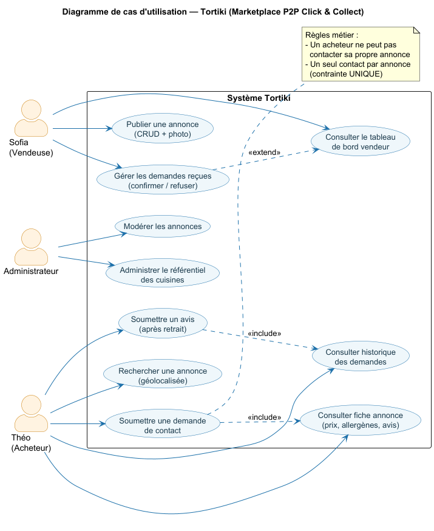
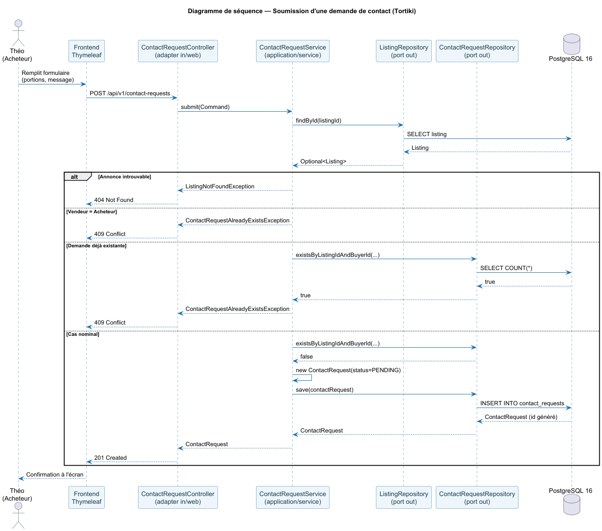
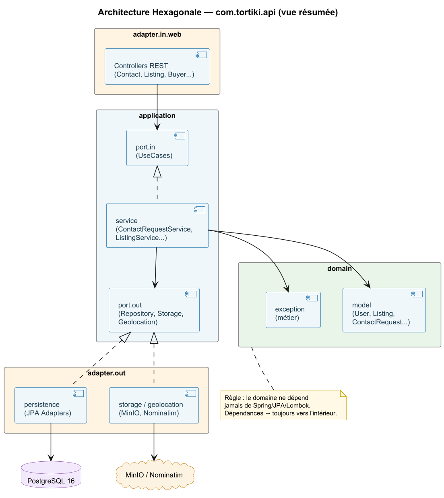
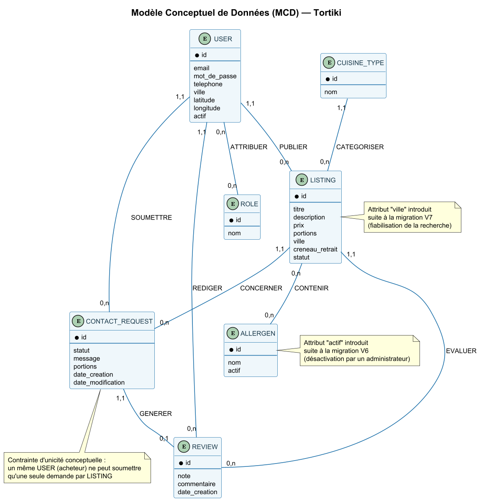
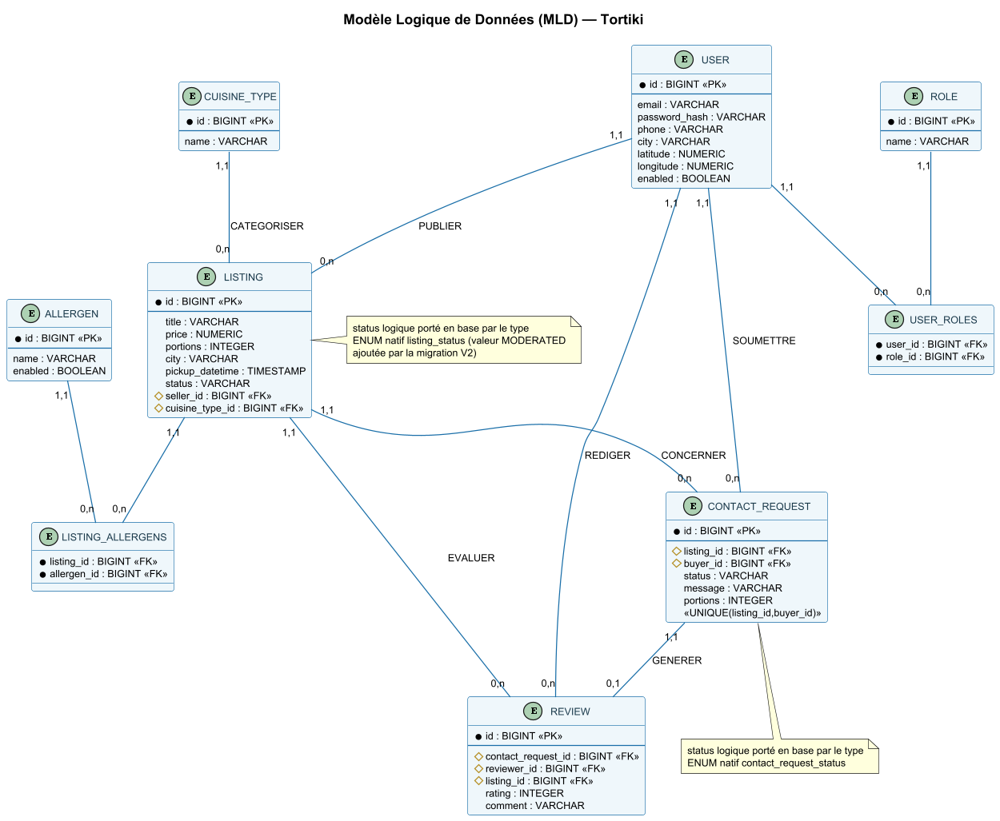
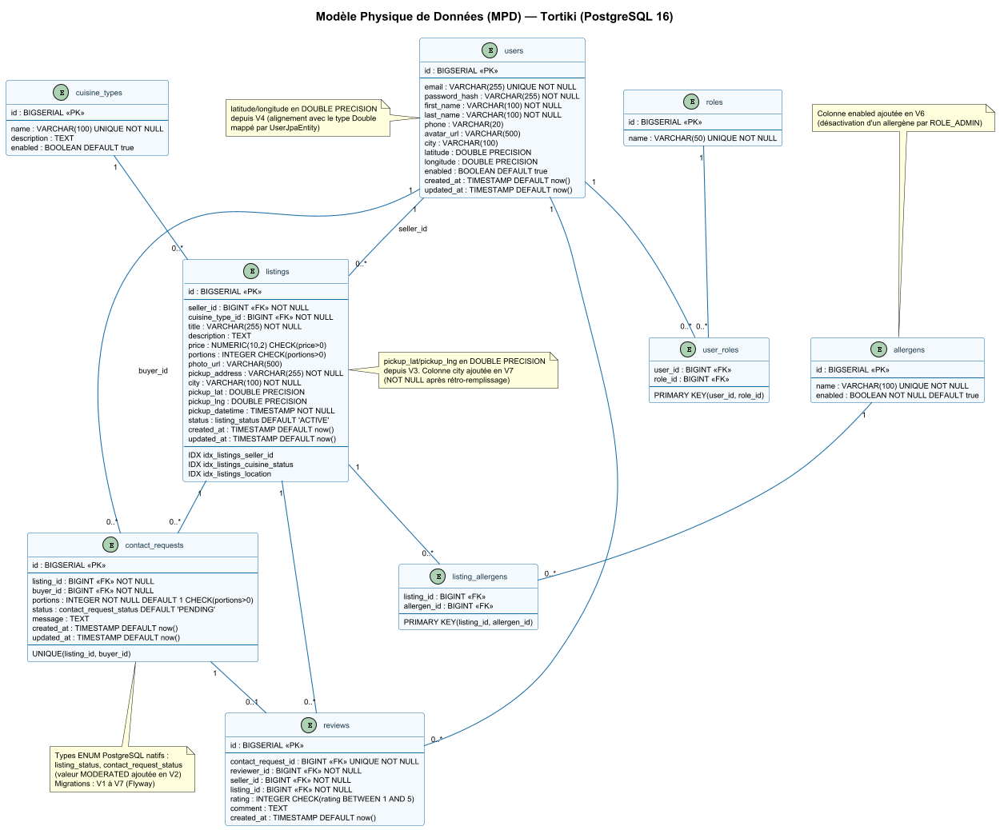
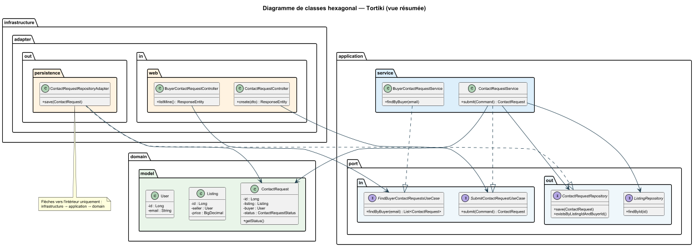

<div style="text-align:center; page-break-after: always; padding-top:200px;">

# DOSSIER DE PROJET

## Titre Professionnel Concepteur Développeur d'Applications — Niveau 6

### Projet Tortiki — Marketplace P2P Click & Collect de plats faits maison

[IMAGE À INSÉRER — Logo Tortiki (page de garde, format carré, fond transparent)]

---

**Candidat :** FERMIN HERRERA Julio
**Session d'examen :** 2026
**Entreprise d'accueil :** Les Lumières d'Ukraine
**Tuteur de stage :** Roman FILINYUK
**Période de stage / réalisation du projet :** 11 mai 2026 – 17 juillet 2026

---


</div>

<div style="page-break-after: always;">

## Sommaire

1. Liste des compétences mises en œuvre
2. Présentation de l'entreprise et du contexte de stage
3. Cahier des charges et expression des besoins
4. Environnement technique et gestion de projet
5. Spécifications fonctionnelles
6. Architecture logicielle et base de données
7. Spécifications techniques et sécurité
8. Réalisations
9. Plan de tests et jeux d'essai
10. Veille technologique et sécurité
11. Synthèse et perspectives

**Annexes (40 pages maximum)**
A. Maquettes des écrans
B. Diagrammes UML (cas d'utilisation, séquence)
C. Extraits de code significatifs
D. Captures d'écran d'interface
E. Jeux de tests détaillés

</div>

<div style="page-break-after: always;"></div>

## 1. Liste des compétences mises en œuvre

Cette section liste les 13 compétences du référentiel CDA réparties en 3 blocs d'activités types, et précise pour chacune comment le projet Tortiki, réalisé en entreprise pendant la période de stage, en apporte la preuve concrète.

### Bloc 1 — Développer une application sécurisée

| Compétence                                           | Mise en œuvre dans Tortiki                                                                                                             |
|------------------------------------------------------|----------------------------------------------------------------------------------------------------------------------------------------|
| Installer et configurer son environnement de travail | Setup Java 21/25, Spring Boot 3.5, Docker Compose (PostgreSQL 16, MinIO), profils YAML dev/prod/test                                   |
| Développer des interfaces utilisateur                | Maquettes type wireframes puis templates Thymeleaf/Bootstrap 5 pour les 8 écrans (accueil, fiche annonce, dashboard vendeur…)          |
| Développer des composants métier                     | Services applicatifs `UserService`, `ListingService`, `SearchListingsService`, `ContactRequestService` en couche `application/service` |
| Contribuer à la gestion d'un projet informatique     | Découpage en Phase 0 + 4 sprints, suivi GitHub Projects/Issues, Gitflow avec Conventional Commits                                      |

### Bloc 2 — Concevoir et développer une application sécurisée organisée en couches

| Compétence | Mise en œuvre dans Tortiki |
|---|---|
| Analyser les besoins et maquetter une application | Cahier des charges v3.0, personas Sofia/Théo, priorisation MoSCoW, 8 maquettes fonctionnelles |
| Définir l'architecture logicielle d'une application | Architecture Hexagonale imposée par le tuteur de stage en cours de projet : domain / application (port in/out) / infrastructure (adapter in/out) / config |
| Concevoir et mettre en place une base de données relationnelle | Modélisation des entités User, Role, Listing, CuisineType, ContactRequest, Review, Allergen ; migrations Flyway V1 à V4 |
| Développer des composants d'accès aux données SQL et NoSQL | Adaptateurs JPA (`UserRepositoryAdapter`, `ListingRepositoryAdapter`) avec Testcontainers PostgreSQL, `MinioStorageAdapter` pour le stockage objet |

<div style="page-break-inside: avoid;">

### Bloc 3 — Préparer le déploiement d'une application sécurisée

| Compétence | Mise en œuvre dans Tortiki |
|---|---|
| Préparer et exécuter les plans de tests d'une application | 158 tests JUnit 5 (unitaires + intégration), Mockito, rapports Allure, couverture JaCoCo ≥ 70 % |
| Préparer et documenter le déploiement d'une application | Pipeline GitHub Actions (4 jobs : Checkstyle, Build/Test, Docker, Notify), documentation OpenAPI/Swagger |
| Contribuer à la mise en production dans une démarche DevOps | CI/CD shift-left, SonarCloud, Docker Compose reproductible, déploiement HTTPS prévu en Sprint 4 |

### Compétence transversale — Sécurité

La sécurité est intégrée à chaque bloc plutôt qu'isolée, conformément à l'esprit « secure by design » du référentiel : Spring Security 6 en sessions stateful, RBAC (ADMIN/SELLER/BUYER), BCrypt force 12, protection CSRF, et conformité RGPD/OWASP Top 10 documentées dès la conception.

</div>

<div style="page-break-before: always;"></div>

## 2. Présentation de l'entreprise et du contexte de stage

### 2.1 L'entreprise d'accueil

Le projet Tortiki a été conçu et développé au cours d'une période de stage en entreprise, dans le cadre de la préparation du Titre Professionnel Concepteur Développeur d'Applications. L'entreprise a confié au candidat la réalisation complète d'un MVP démontrable, du cahier des charges jusqu'au déploiement.

| Élément | Détail |
|---|---|
| Nom de l'entreprise | Les Lumières d'Ukraine |
| Secteur d'activité | [Secteur d'activité] |
| Adresse | 2, rue de Badonviller 54000 Nancy |
| Tuteur de stage | Roman FILINYUK |
| Période de stage | 11 mai 2026 – 17 juillet 2026 |
| Mission confiée | Conception et développement du MVP Tortiki, marketplace P2P Click & Collect |

[IMAGE À INSÉRER — Logo de l'entreprise d'accueil]

### 2.2 Contexte de la mission

Le tuteur de stage a imposé dès la Phase 0 le cadre technique et méthodologique du projet : architecture hexagonale, stack Java 21/Spring Boot 3.5, et une démarche qualité stricte (Checkstyle, JaCoCo, SonarCloud). Cette contrainte, initialement pensée en Clean Architecture, a été réorientée par le tuteur vers une architecture hexagonale en cours de Phase 0, illustrant une adaptation méthodologique réelle en contexte professionnel.

### 2.3 Rôle du candidat dans l'entreprise

Le candidat a occupé un rôle de développeur au sein de l'équipe, avec une autonomie complète sur l'implémentation, sous validation régulière du tuteur de stage à chaque étape clé (choix d'architecture, revues de code, arbitrages de sécurité).

<div style="page-break-before: always;"></div>

## 3. Cahier des charges et expression des besoins

### 3.1 Présentation du projet

Tortiki est une application web de type marketplace P2P Click & Collect, permettant à des cuisiniers amateurs de vendre des plats faits maison à une clientèle locale. Le projet répond à un vide laissé par les plateformes de livraison traditionnelles, orientées professionnels de la restauration, en proposant un cadre local, accessible et sécurisé, orienté découverte gastronomique.

[IMAGE À INSÉRER — Capture d'écran : page d'accueil Tortiki (hero, recherche par ville, cuisines du monde)]

### 3.2 Contexte et objectif général

L'objectif est de créer un MVP démontrable permettant à un vendeur de publier une annonce, à un client de la rechercher et d'exprimer son intérêt, puis au vendeur de confirmer la demande avant le retrait. Six mois après mise en ligne, les cibles fixées sont 50 vendeurs actifs, 200 acheteurs actifs, une note moyenne de satisfaction de 4,25, un temps de réponse API p95 de 500 ms et une disponibilité mensuelle de 99,5 %.

### 3.3 Personas

| Persona | Profil | Besoin principal |
|---|---|---|
| Sofia (Vendeuse) | 38 ans, Nancy, cuisinière ukrainienne | Générer un revenu complémentaire et partager sa culture culinaire |
| Théo (Client) | 26 ans, étudiant, usage smartphone | Trouver rapidement un plat varié et abordable près de lui |

[IMAGE À INSÉRER — Fiches persona illustrées Sofia et Théo]

### 3.4 Périmètre fonctionnel MVP

Le MVP couvre l'inscription, la gestion des rôles vendeur/client, le CRUD d'annonces avec photo et créneau de retrait unique, la recherche géographique, le filtrage par origine culinaire et allergènes, l'expression d'intérêt, la confirmation/refus par le vendeur, la notation après retrait, ainsi que l'administration du référentiel des cuisines. Sont explicitement exclus de la v1 : la livraison à domicile, l'application mobile native, la messagerie instantanée, le panier multi-vendeurs, les notifications push et l'authentification JWT (reportée en v2).

<div style="page-break-inside: avoid;">

### 3.5 User stories principales et priorisation MoSCoW

| ID | User Story | Priorité |
|---|---|---|
| US-01 | Inscription visiteur (email, mot de passe fort, validation serveur) | Must |
| US-02 | Choix et cumul du rôle vendeur/client | Must |
| US-03 | Création/modification/suppression d'annonce | Must |
| US-05 | Gestion des demandes d'intérêt reçues (confirmer/refuser) | Must |
| US-06 | Recherche géographique par ville/code postal | Must |
| US-07 | Filtres origine culinaire et allergènes | Must |
| US-08 | Expression d'intérêt et obtention des coordonnées vendeur | Must |
| US-09 | Notation du vendeur après retrait | Should |
| US-10 | Administration des origines culinaires et modération | Must |

</div>

### 3.6 Exigences non fonctionnelles

Le cahier des charges fixe des exigences précises en performance (500 ms p95), disponibilité (99,5 %), sécurité (OWASP Top 10, BCrypt, TLS/HTTPS), accessibilité (RGAA 4.1 niveau AA) et RGPD (droit à l'effacement, durées de conservation documentées par entité). La maintenabilité est exigée via une couverture de tests cible de 70 % minimum et une analyse continue SonarCloud sans anomalie bloquante.

### 3.7 Stack technique retenue

| Domaine | Choix |
|---|---|
| Backend | Java 21/25, Spring Boot 3.5.x, Architecture Hexagonale |
| Frontend | Thymeleaf 3.1, Bootstrap 5, OpenFeign |
| Base de données | PostgreSQL 16, Flyway |
| Sécurité | Spring Security 6, sessions HTTP stateful (JWT différé en v2) |
| Qualité | JUnit 5, Testcontainers, JaCoCo, SonarCloud, Checkstyle |

<div style="page-break-before: always;"></div>

## 4. Environnement technique et gestion de projet

### 4.1 Planning global et milestones

Le projet Tortiki est découpé en une Phase 0 de cadrage suivie de 4 sprints, avec une deadline finale du MVP fixée au 17 juillet 2026, en cohérence avec la durée du stage en entreprise.

| Milestone | Période | Contenu | Statut |
|---|---|---|---|
| Phase 0 — Cadrage | 13/05 – 24/05/2026 | Socle technique, sécurité, CI/CD (issues 1-10) | Clôturée |
| Sprint 1 — Socle | 25/05 – 07/06/2026 | Domain, application, persistance, auth (issues 11-28) | Clôturée |
| Sprint 2 — Découverte | 08/06 – 21/06/2026 | Recherche géolocalisée, allergènes, contact (issues 29-39) | Clôturée |
| Sprint 3 — Confiance | 22/06 – 05/07/2026 | Notation, admin, dashboard vendeur (issues 40-48) | Clôturée |
| Sprint 4 — Livraison | 06/07 – 17/07/2026 | Déploiement, documentation finale (issues 49-59) | En cours |

[GRAPHIQUE À INSÉRER — Diagramme de Gantt du planning Phase 0 + Sprints 1 à 4, avec jalons datés]

### 4.2 Suivi et outils de collaboration

Le pilotage repose sur deux dépôts GitHub distincts (tortiki-api et tortiki-frontend), avec GitHub Projects pour la gestion des issues, un Gitflow strict (branches feat/fix/test préfixées par sprint, merge sur develop) et des Conventional Commits systématiques.

[IMAGE À INSÉRER — Capture d'écran du tableau GitHub Projects (colonnes To Do / In Progress / Done)]

### 4.3 Environnement humain

| Acteur | Rôle | Responsabilité |
|---|---|---|
| Tuteur de stage | Maîtrise d'ouvrage / encadrement | Définit les besoins, impose les choix d'architecture, valide les livrables |
| Candidat CDA | Développeur | Conçoit, développe, teste et documente l'application |
| Utilisateurs pilotes | Testeurs fonctionnels | Vérifient les parcours métier (personas Sofia/Théo) |
| Jury CDA | Évaluateur | Évalue la conformité au référentiel CDA |

### 4.4 Objectifs et suivi qualité

La démarche qualité de Tortiki repose sur quatre seuils mesurables, vérifiés automatiquement à chaque commit via le pipeline CI/CD : zéro violation Checkstyle Google Style, couverture JaCoCo ≥ 70 %, ensemble des tests JUnit 5 au vert, et analyse SonarCloud sans anomalie bloquante ou critique.

| Date | Périmètre | Tests JUnit 5 | Couverture JaCoCo | Checkstyle | SonarCloud |
|---|---|---|---|---|---|
| 09/06/2026 | Backend (domain/service) | 33 tests passants | 100 % sur domain/service | 0 violation | Configuré, sans blocker |
| 24/06/2026 | Backend (API complète) | 86 tests, 0 échec | Seuil 70 % atteint | 0 violation | Aucun blocker/critical |
| 25/06/2026 | Backend (Sprint 3) | 94 tests, 0 échec | Seuil 70 % atteint | 0 violation | Aucun blocker/critical |
| 15/07/2026 | Backend (Sprint 4, historique acheteur) | 158 tests, 0 échec | Seuil 70 % atteint | 0 violation | Aucun blocker/critical |
| 13/07/2026 | Frontend (9 contrôleurs) | 68 tests, 0 échec | Seuil 70 % (38 classes) | 0 violation | Aucun blocker/critical |

[GRAPHIQUE À INSÉRER — Courbe d'évolution de la couverture JaCoCo et du nombre de tests JUnit 5 par sprint]

<div style="page-break-before: always;"></div>

## 5. Spécifications fonctionnelles

### 5.1 Acteurs du système

| Rôle | Persona | Périmètre fonctionnel |
|---|---|---|
| ROLE_BUYER | Théo, étudiant, usage mobile | Recherche, consultation fiche plat, demande de contact, avis |
| ROLE_SELLER | Sofia, cuisinière ukrainienne | Publication d'annonces, gestion des demandes reçues, tableau de bord |
| ROLE_ADMIN | Gestionnaire plateforme | Modération des annonces, gestion des types de cuisine, panel admin |

### 5.2 User stories principales

- En tant que Théo, je veux rechercher des plats par ville et type de cuisine pour trouver une annonce proche de moi.
- En tant que Théo, je veux consulter la fiche d'un plat (prix, allergènes, avis) avant de faire une demande.
- En tant que Théo, je veux soumettre une demande de contact avec un nombre de portions et un message optionnel.
- En tant que Théo, je veux consulter l'historique de mes demandes de contact.
- En tant que Sofia, je veux publier une annonce avec photo, prix, portions et créneau de retrait unique.
- En tant que Sofia, je veux consulter mon tableau de bord pour confirmer ou refuser les demandes reçues.
- En tant qu'admin, je veux désactiver une annonce non conforme et gérer le référentiel des types de cuisine.

<div style="page-break-inside: avoid;">

### 5.3 Parcours utilisateur et enchaînement des écrans

| Étape | Écran | Acteur |
|---|---|---|
| 1 | Accueil / Recherche géolocalisée | Théo |
| 2 | Fiche annonce (détail plat, allergènes, avis) | Théo |
| 3 | Formulaire de contact (portions, message) | Théo |
| 4 | Mes demandes (historique statuts) | Théo |
| 5 | Tableau de bord vendeur | Sofia |
| 6 | Créer une annonce | Sofia |
| 7 | Gérer une demande (confirmer/refuser) | Sofia |
| 8 | Inscription / Connexion | Commun |

[IMAGE À INSÉRER — Wireflow / enchaînement des 8 maquettes d'écrans (schéma de navigation)]

</div>

<div style="page-break-inside: avoid;">

### 5.4 Modélisation UML — Cas d'utilisation

Le diagramme de cas d'utilisation formalise les interactions entre les trois acteurs et le système autour de quatre grands cas : rechercher une annonce, publier une annonce, soumettre une demande de contact, et administrer la plateforme. Ce diagramme s'appuie directement sur les ports primaires de l'architecture hexagonale (`SearchListingsUseCase`, `ManageListingUseCase`, `SubmitContactRequestUseCase`).


> — Diagramme de cas d'utilisation UML (acteurs Théo/Sofia/Admin et cas d'usage)
</div>

<div style="page-break-inside: avoid;">

### 5.5 Diagramme de séquence — Cas d'usage représentatif

Le parcours « Soumission d'une demande de contact » illustre le flux complet entre le frontend Thymeleaf, le contrôleur REST `ContactRequestController`, le service applicatif `ContactRequestService` et la persistance, avec gestion du conflit 409 en cas de doublon ou d'auto-contact vendeur/acheteur.



>— Diagramme de séquence UML du cas d'usage « Soumission d'une demande de contact

</div>

<div style="page-break-before: always;"></div>

## 6. Architecture logicielle et base de données

### 6.1 Architecture Hexagonale retenue

L'architecture hexagonale a été imposée par le tuteur de stage en cours de Phase 0, en remplacement d'une première approche en Clean Architecture, avec une règle fondamentale : les dépendances ne pointent que vers l'intérieur, le domaine ne connaissant jamais Spring ni JPA. Cette réorientation méthodologique, décidée en entreprise, a nécessité un refactoring complet des packages via l'outil Refactor > Move d'IntelliJ, sans réécriture de logique métier.

| Couche | Rôle | Exemple |
|---|---|---|
| domain/model | POJOs métier purs, zéro annotation | User.java, Listing.java, ContactRequest.java |
| domain/exception | Exceptions métier | ListingNotFoundException |
| application/port/in | Interfaces cas d'usage | SubmitContactRequestUseCase |
| application/port/out | Interfaces Repository/Gateway | ContactRequestRepository, StoragePort |
| application/service | Implémentation des ports in | ContactRequestService |
| infrastructure/adapter/out/persistence | Entités JPA, JpaRepository | ListingEntity, ListingRepositoryAdapter |
| infrastructure/adapter/in/web | Contrôleurs REST, DTOs Records | ContactRequestController |


>— Diagramme de l'architecture hexagonale Tortiki (domain / application / infrastructure)

La séparation stricte entre `domain/model/User.java` (POJO pur) et `infrastructure/adapter/out/persistence/UserEntity.java` (entité JPA annotée) illustre concrètement cette règle : si demain PostgreSQL est remplacé par MongoDB, seule `UserEntity` est modifiée, jamais `User` ni `UserService`. La règle a été étendue au refus de Lombok dans `domain/model`, considéré comme une dépendance externe à la couche la plus stable du projet.

### 6.2 Modèle conceptuel de données

Le MCD couvre sept entités métier avec leurs cardinalités exactes : User, Role, Listing, CuisineType, Allergen, ContactRequest, Review, ainsi que les tables d'association nécessaires. Deux types énumérés PostgreSQL natifs (`listing_status`, `contact_request_status`) renforcent l'intégrité des données par rapport à un simple champ VARCHAR.

| Entité | Relations principales |
|---|---|
| User | 1,n vers Listing (vendeur), n,n vers Role via user_roles |
| Listing | n,1 vers CuisineType, n,n vers Allergen via listing_allergens |
| ContactRequest | n,1 vers Listing et User (acheteur), contrainte UNIQUE(listing_id, buyer_id) |
| Review | 1,1 vers ContactRequest, n,1 vers User (reviewer/seller) et Listing |


> MCD complet (Modèle Conceptuel de Données) avec cardinalités

### 6.3 Modèle logique de données

Le MLD Reprend les 8 entités logiques (`USER`, `ROLE`, `LISTING`, `CUISINE_TYPE`, `ALLERGEN`, `CONTACT_REQUEST`, `REVIEW` + tables d'association) avec typage logique (BIGINT, VARCHAR, NUMERIC), clés primaires/étrangères marquées `<<PK>>`/`<<FK>>`, et la contrainte d'unicité `UNIQUE(listing_id, buyer_id)` sur `ContactRequest`.



### 6.4 Modèle phisique de données

Le MPD est la version physique directement alignée sur les scripts Flyway réels (noms de tables en snake_case, `BIGSERIAL`, `NUMERIC(8,2)`, contraintes `CHECK`, types ENUM natifs `listing_status`/`contact_request_status`, index `idx_listings_cuisine_status` et `idx_listings_location`), avec une note rappelant les migrations V1 à V4.



### 6.5 Scripts Flyway et évolution du schéma

La règle Flyway appliquée sur le projet est absolue : un script déjà exécuté en base ne doit jamais être modifié, toute évolution passe par une nouvelle version.

| Version | Contenu | Déclencheur |
|---|---|---|
| V1__init_schema.sql | 7 tables, types ENUM, contraintes CHECK/UNIQUE, index, données initiales | Schéma initial Phase 0 |
| V2__add_user_profile_fields.sql | Ajout phone, avatar_url, city, latitude, longitude sur users | Localisation vendeur manquante |
| V3 | Table reviews et contraintes associées | Ajout du système d'évaluation Sprint 3 |
| V4 | Migrations complémentaires Sprint 3 | Enrichissements ContactRequest |

### 6.5 Diagramme de classes

Le Diagramme de classes montre une vue résumée centrée sur le cas d'usage `ContactRequest` pour rester lisible : `domain.model` (vert) → `application.port.in/out` et `service` (bleu) → `infrastructure.adapter.in.web/out.persistence` (orange), avec les relations `..|>` (implémentation) et `-->` (dépendance) montrant explicitement le sens des flèches vers l'intérieur uniquement.



### 6.7 Décisions techniques justifiées

| Décision | Choix retenu | Justification |
|---|---|---|
| Architecture | Hexagonale (imposée en cours de projet) | Décision du tuteur de stage, remplace la Clean Architecture initiale |
| Sécurité v1 | Sessions stateful | JWT reporté en v2, point de veille CDA documenté |
| Lombok | Version 1.18.38, interdit dans domain/model | Compatibilité Java 21/25 ; domaine 100 % Java pur |
| ContactRequest constructeur | Setters uniquement, sans constructeur complet | Violation Checkstyle ParameterNumber (8 paramètres > 7 autorisés) |
| Latitude/longitude | BigDecimal | Cohérence avec le type NUMERIC(10,7) PostgreSQL |

<div style="page-break-before: always;"></div>

## 7. Spécifications techniques et sécurité

### 7.1 Stratégie d'authentification

Le MVP retient des sessions HTTP stateful plutôt qu'un JWT, ce dernier étant volontairement reporté en v2. Spring Boot auto-configure `DaoAuthenticationProvider` dès que les beans `UserDetailsService` et `PasswordEncoder` sont présents dans le contexte.

| Aspect | Choix retenu | Justification |
|---|---|---|
| Type de session | Stateful, `SessionCreationPolicy.ALWAYS` | Cohérent avec une API consommée par un frontend Thymeleaf/Feign |
| Sessions concurrentes | `maximumSessions(1)` | Une session active par utilisateur |
| Encodage mot de passe | BCrypt force 12 | Recommandation OWASP |
| AuthenticationProvider | Non déclaré manuellement | Auto-configuré par Spring Boot depuis 6.4 |

### 7.2 Contrôle d'accès par rôle (RBAC)

| Niveau | Exemple de route | Règle |
|---|---|---|
| Public | `GET /api/v1/listings`, Swagger UI | `permitAll()` |
| Authentification | `POST /api/v1/auth/register`, `/login`, `/logout` | `permitAll()` |
| Acheteur | `POST /api/v1/contact-requests`, `GET .../my` | `hasRole(ROLE_BUYER)` |
| Vendeur | `POST/PUT/DELETE /api/v1/listings` | `hasRole(ROLE_SELLER)` |
| Administration | `/api/v1/admin/**` | `hasRole(ROLE_ADMIN)` |

### 7.3 CSRF et RGPD

Le CSRF est désactivé uniquement sur le préfixe `/api/v1` car l'API est consommée exclusivement par des clients HTTP sans formulaires HTML. Côté RGPD, le DTO `ReviewResponse` n'expose jamais l'email du reviewer, uniquement son prénom, et l'identité de l'acheteur (`BuyerContactRequestController`) est toujours résolue via le `Principal` de session, jamais via un ID fourni par le client.

| Risque RGPD | Traitement appliqué |
|---|---|
| Exposition email acheteur | Jamais renvoyé dans les DTOs publics |
| Résolution d'identité | Via `Principal`, jamais d'ID transmis par le client |
| Mot de passe | Stocké exclusivement en hash BCrypt |

### 7.4 Couverture OWASP Top 10

| Catégorie OWASP | Mesure Tortiki |
|---|---|
| A01 Broken Access Control | RBAC strict par `hasRole`, `@PreAuthorize` sur les endpoints sensibles |
| A02 Cryptographic Failures | BCrypt force 12 sur tous les mots de passe |
| A03 Injection | Requêtes Spring Data JPA paramétrées |
| A05 Security Misconfiguration | Swagger désactivé en prod |
| A07 Identification and Authentication Failures | Sessions limitées à 1 par utilisateur |

<div style="page-break-before: always;"></div>

## 8. Réalisations

### 8.1 Couche Domain (backend)

Tous les POJOs métier sont purs, sans annotation Spring ni JPA : `User`, `Role`, `Listing`, `CuisineType`, `Allergen`, `ContactRequest`, `Review`. La classe `ContactRequest` illustre la règle « Java pur en domain ».

```java
package com.tortiki.api.domain.model;

import java.time.LocalDateTime;

/**
 * Représente une demande d'intérêt d'un acheteur pour une annonce de plat.
 * <p>POJO pur du domaine : aucune annotation Spring ou JPA. Un acheteur ne
 * peut soumettre qu'une seule demande par annonce (contrainte
 * {@code UNIQUE(listing_id, buyer_id)} en base).</p>
 */
public class ContactRequest {

  private Long id;
  private Listing listing;
  private User buyer;
  private ContactRequestStatus status;
  private String message;
  private Integer portions;
  private LocalDateTime createdAt;
  private LocalDateTime updatedAt;

  /** Constructeur par défaut requis par les mappers infrastructure. */
  public ContactRequest() {
  }

  public Long getId() {
    return id;
  }

  public void setId(final Long id) {
    this.id = id;
  }

  // ... getters/setters manuels pour chaque champ (voir Annexe C)
}
```

### 8.2 Couche Application (ports et services)

Le service `ContactRequestService` orchestre trois règles métier séquentielles avant persistance : existence de l'annonce, interdiction pour le vendeur de contacter sa propre annonce, et unicité de la demande par acheteur et par annonce.

```java
package com.tortiki.api.application.service;

import com.tortiki.api.application.port.in.SubmitContactRequestUseCase;
import com.tortiki.api.application.port.out.ContactRequestRepository;
import com.tortiki.api.application.port.out.ListingRepository;
import com.tortiki.api.domain.exception.ContactRequestAlreadyExistsException;
import com.tortiki.api.domain.exception.ListingNotFoundException;
import com.tortiki.api.domain.model.ContactRequest;
import com.tortiki.api.domain.model.ContactRequestStatus;
import com.tortiki.api.domain.model.Listing;
import java.time.LocalDateTime;
import lombok.RequiredArgsConstructor;
import org.springframework.stereotype.Service;

/**
 * Service applicatif pour la soumission d'une demande de contact.
 * <p>Implémente {@link SubmitContactRequestUseCase} et orchestre les règles
 * métier avant persistance : l'annonce doit exister, l'acheteur ne peut pas
 * contacter sa propre annonce, un seul contact par acheteur et par annonce.</p>
 */
@Service
@RequiredArgsConstructor
public class ContactRequestService implements SubmitContactRequestUseCase {

  private final ContactRequestRepository contactRequestRepository;
  private final ListingRepository listingRepository;

  @Override
  public ContactRequest submit(final Command command) {
    Listing listing = listingRepository.findById(command.listingId())
        .orElseThrow(() -> new ListingNotFoundException(command.listingId()));

    if (listing.getSeller().getId().equals(command.buyerId())) {
      throw new ContactRequestAlreadyExistsException(
          "Un vendeur ne peut pas contacter sa propre annonce.");
    }
    if (contactRequestRepository.existsByListingIdAndBuyerId(
        command.listingId(), command.buyerId())) {
      throw new ContactRequestAlreadyExistsException(
          "Une demande existe déjà pour cette annonce.");
    }

    ContactRequest contactRequest = new ContactRequest();
    contactRequest.setListing(listing);
    contactRequest.setBuyerId(command.buyerId());
    contactRequest.setMessage(command.message());
    contactRequest.setPortions(command.portions());
    contactRequest.setStatus(ContactRequestStatus.PENDING);
    contactRequest.setCreatedAt(LocalDateTime.now());
    return contactRequestRepository.save(contactRequest);
  }
}
```

| Service | Rôle |
|---|---|
| ListingService.java | Service principal, CRUD + upload photo |
| ContactRequestService.java | Soumission des demandes, règles vendeur ≠ acheteur, unicité |
| BuyerContactRequestService.java | Historique des demandes de l'acheteur authentifié |
| SearchListingsService.java | Moteur de recherche géolocalisé via Nominatim |

### 8.3 Couche Infrastructure (adapters backend)

| Adapter | Détail |
|---|---|
| MinioStorageAdapter | Upload photo avec slug UUID |
| NominatimGateway | WebClient, conforme RGPD |
| BuyerContactRequestController | `GET /api/v1/contact-requests/my`, identité résolue via `Principal` |

[IMAGE À INSÉRER — Capture d'écran Swagger/OpenAPI listant les endpoints REST de l'API Tortiki]

### 8.4 Réalisations frontend (tortiki-frontend)

| Template | Rôle |
|---|---|
| home.html | Hero, recherche par ville, cuisines du monde |
| search-results.html | Grille de résultats, filtres, pagination |
| dashboard.html | Demandes reçues, actions Confirmer/Refuser |
| listing-detail.html | Fiche plat, avis, formulaire de contact inline |
| buyer-requests.html | Historique des demandes acheteur |

[IMAGE À INSÉRER — Capture d'écran : fiche annonce (listing-detail.html) desktop et mobile 375px]

[IMAGE À INSÉRER — Capture d'écran : tableau de bord vendeur (dashboard.html)]

<div style="page-break-before: always;"></div>

## 9. Plan de tests et jeux d'essai

### 9.1 Stratégie de test à deux niveaux

| Type de test | Outil | Convention | Déclenchement |
|---|---|---|---|
| Unitaire | Surefire | `*Test.java` | Systématique, sans Docker |
| Intégration | Failsafe | `*IT.java` | Testcontainers PostgreSQL |

### 9.2 Extrait de test unitaire — BuyerContactRequestServiceTest

Le test ci-dessous vérifie, via Mockito, que le service n'interroge jamais le dépôt des demandes de contact si l'acheteur n'est pas trouvé, garantissant l'ordre correct des règles métier.

```java
@Test
@Story("Règle métier")
@DisplayName("findByBuyer lève UserNotFoundException si l'acheteur est introuvable")
void shouldThrowWhenBuyerNotFound() {
  givenBuyerDoesNotExist();

  assertThatThrownBy(() -> buyerContactRequestService.findByBuyer(BUYER_EMAIL))
      .isInstanceOf(UserNotFoundException.class)
      .hasMessageContaining(BUYER_EMAIL);

  verify(contactRequestRepository, never()).findByBuyerId(any());
}
```

### 9.3 Tests unitaires par couche

| Classe de test | Nombre de tests | Couverture |
|---|---|---|
| UserServiceTest | 7 | 100 % |
| ListingServiceTest | 15 | 100 % |
| CuisineTypeServiceTest | 10 | 100 % |
| ContactRequestServiceTest | 5 | Cas nominal + doublon 409 + auto-contact |
| BuyerContactRequestServiceTest | 3 | Nominal, liste vide, UserNotFoundException |
| BuyerContactRequestControllerTest | 4 | 200 liste, 200 vide, 401, 403 |

### 9.4 Jeu d'essai — fonctionnalité représentative

Fonctionnalité retenue : soumission d'une demande de contact (`SubmitContactRequestUseCase`).

| Donnée en entrée | Donnée attendue | Donnée obtenue | Écart |
|---|---|---|---|
| listingId valide, buyerId valide, portions=2 | HTTP 201, statut PENDING | HTTP 201, statut PENDING | Aucun |
| Doublon (même listingId + buyerId) | HTTP 409 Conflict | HTTP 409 Conflict | Aucun |
| buyerId = vendeur de l'annonce | HTTP 409 Conflict | HTTP 409 Conflict | Aucun |
| listingId inexistant | HTTP 404 | HTTP 404 | Aucun |

[IMAGE À INSÉRER — Capture d'écran du rapport Allure (vue synthétique des tests par Epic/Feature)]

### 9.5 Seuil JaCoCo et exclusions légitimes

Le seuil `COVERED_RATIO` minimum de 0.70 sur `LINE` s'applique au bundle fusionné (unitaires + intégration), avec des exclusions justifiées : `domain/model` (POJOs sans logique), `domain/exception`, `config`, et le point d'entrée `TortikiApiApplication`.

[GRAPHIQUE À INSÉRER — Graphique JaCoCo (camembert ou barres) : répartition de la couverture par package]

<div style="page-break-before: always;"></div>

## 10. Veille technologique et sécurité

### 10.1 Dépréciations API Spring Security 6.4

| Avertissement détecté | Cause | Résolution appliquée |
|---|---|---|
| `setUserDetailsService` déprécié | API Spring Security 6.4 | Constructeur avec paramètres |
| `DaoAuthenticationProvider` déprécié | Idem | Auto-configuration Spring Boot |
| Littéraux dupliqués | Code smell SonarCloud | Extraction en constantes `SecurityConstants` |

### 10.2 CVE transitives héritées de spring-boot-starter-parent

L'analyse Mend.io du `pom.xml` du frontend a signalé des alertes CVE sur Tomcat, Spring Security, Thymeleaf, Jackson et Logback, transitives et héritées de `spring-boot-starter-parent:3.5.3`. Aucune action corrective n'est requise tant que le starter parent reste la source de vérité des versions.

### 10.3 Migration sessions stateful vers JWT (v2)

| Axe de veille | État actuel | Trigger de migration |
|---|---|---|
| Authentification | Sessions stateful | Architecture multi-instances ou API mobile |
| Scalabilité | 1 session active par utilisateur | Montée en charge horizontale |
| Sécurité transport | BCrypt 12, CSRF activé | Reste valable en v2 JWT |

<div style="page-break-before: always;"></div>

## 11. Synthèse et perspectives

Réalisé en entreprise sous la supervision d'un tuteur de stage, le projet Tortiki démontre l'ensemble des 13 compétences du référentiel CDA au travers d'une architecture hexagonale rigoureuse — imposée et adaptée en cours de projet —, d'une stratégie de sécurité intégrée dès la conception et d'une démarche qualité continue (Checkstyle, JaCoCo, SonarCloud). Les principaux axes d'amélioration identifiés pour la v2 sont la migration vers une authentification JWT, la mise en place d'une pagination Spring Data complète côté API, et l'enrichissement du dashboard vendeur avec des statistiques avancées.

[GRAPHIQUE À INSÉRER — Frise chronologique de synthèse du projet (Phase 0 → Sprint 4 → mise en production)]

<div style="page-break-before: always;"></div>

## Annexe A — Maquettes des écrans

[IMAGE À INSÉRER — Planche des 8 maquettes fonctionnelles (accueil, recherche, fiche annonce, contact, dashboard, création annonce, gestion demande, inscription/connexion)]

## Annexe B — Diagrammes UML complets

[SCHÉMA À INSÉRER — Diagramme de cas d'utilisation complet (version haute résolution)]

[SCHÉMA À INSÉRER — Diagramme de séquence complet du parcours de soumission de demande de contact]

## Annexe C — Extraits de code significatifs

Extraits complémentaires issus des sections de développement du projet Tortiki (voir sections 8 et 9 pour les extraits principaux) :

```java
// SubmitContactRequestUseCase.java — Port primaire (application/port/in)
public interface SubmitContactRequestUseCase {

  ContactRequest submit(Command command);

  /**
   * Données nécessaires à la soumission d'une demande de contact.
   */
  record Command(Long listingId, Long buyerId, String message, Integer portions) {
  }
}
```

```java
// BuyerContactRequestControllerTest.java — extrait, cas nominal
@Test
@DisplayName("GET /contact-requests/my → 200 avec liste pour ROLE_BUYER authentifié")
void shouldReturn200WithListWhenBuyerHasRequests() throws Exception {
  when(findBuyerContactRequestsUseCase.findByBuyer("theo@tortiki.fr"))
      .thenReturn(List.of(sampleRequest));

  mockMvc.perform(get("/api/v1/contact-requests/my")
          .with(user("theo@tortiki.fr").roles("BUYER"))
          .with(csrf()))
      .andExpect(status().isOk())
      .andExpect(jsonPath("$[0].status").value("PENDING"));
}
```

## Annexe D — Captures d'écran d'interface

[IMAGE À INSÉRER — Planche de captures d'écran responsive (375px et 1280px) pour les écrans principaux]

## Annexe E — Jeux de tests détaillés

[TABLEAU À INSÉRER — Jeu de tests complet unitaires + intégration + sécurité, avec données en entrée/attendues/obtenues]

<div style="page-break-before: always;"></div>
